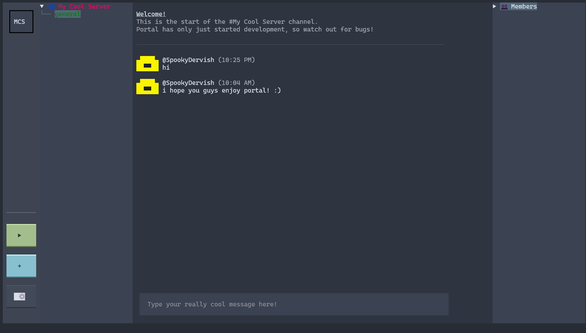
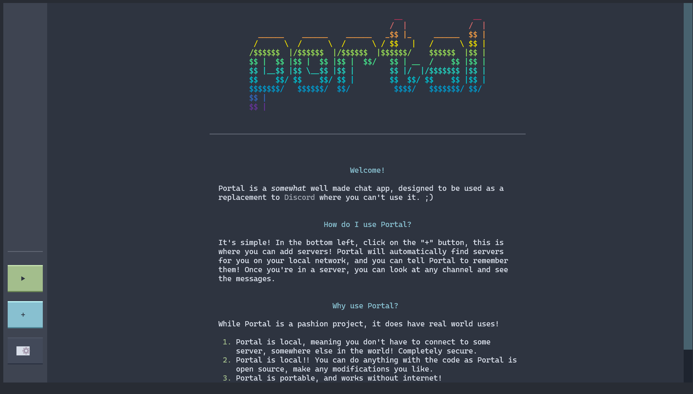

# Portal
Portal is a TCP based LAN chat app! It is an attempt at recreating Discord, but for your terminal, and it's written entirely in Python using the **amazing textual library!**

# Install
> [!IMPORTANT]  
> You should clone the repository, not download the zip. This is because automatic updates require
> that there is a git repo initialised in Portal's folder.

> [!WARNING]  
> Portal is still in an extremely buggy state, there shouldn't be any risks of damage to any devices
> you put Portal on, however only join servers from trusted people, as they can see anything going
> through the server!

## Requirements
- A relatively up to date version of Python. (3.7+ should work, I haven't tested any lower than that)
- Git

Git clone the repo:
> Clone Command: `git clone https://github.com/SpookyDervish/PortalChat`

CD into the repo and install requirements:
> MacOS / Linux: `pip3 install -r requirements.txt`
> Windows: `pip install -r requirements.txt`

Start Portal!
> MacOS: `python3 main.py`
> Windows: `python main.py`

# Screenshots

